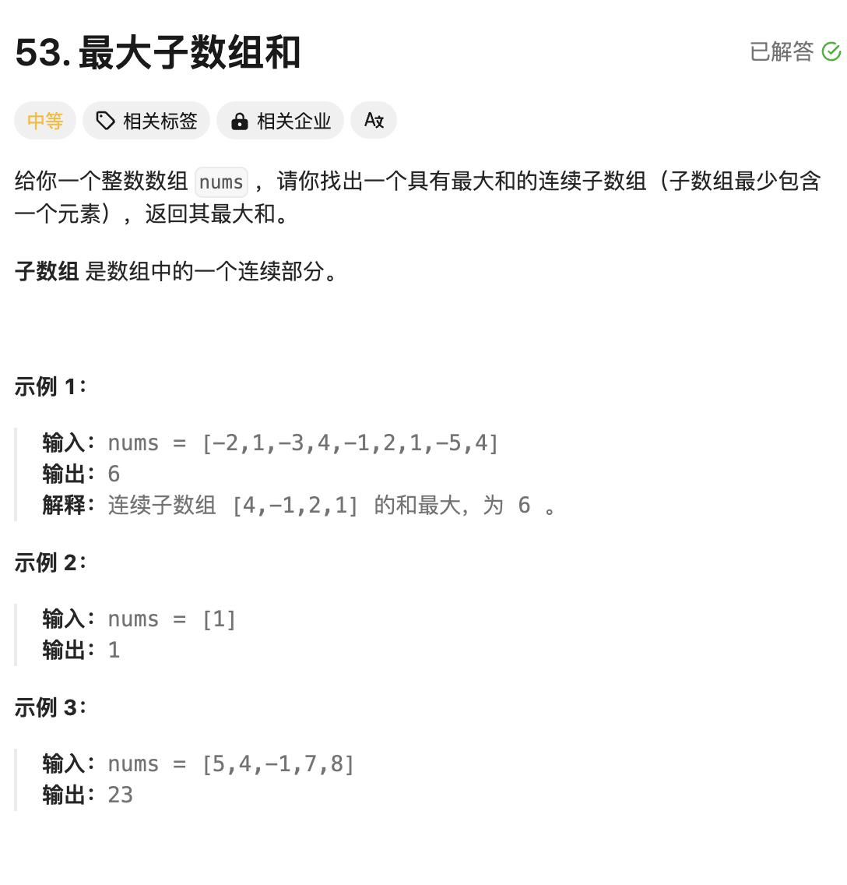
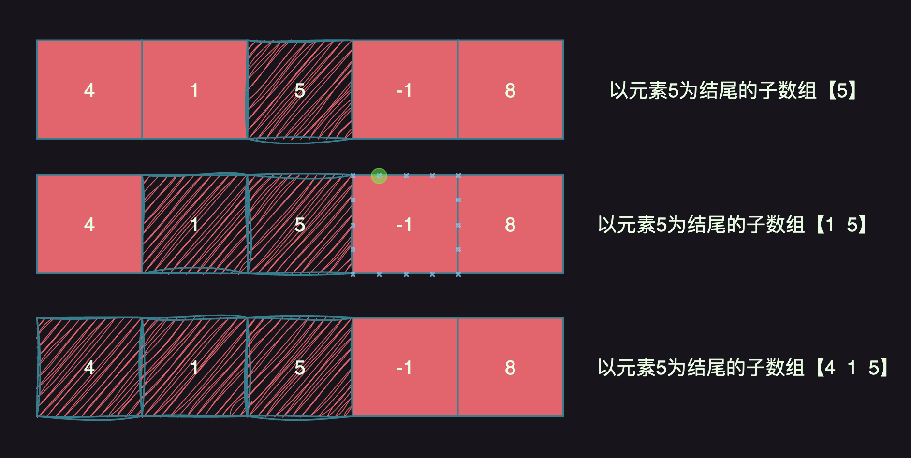

# 题目：[53. 最大子数组和](https://leetcode.cn/problems/maximum-subarray/)




# 思路

一般看到题目要求最值问题，就想到动态规划的思路。

```
动态规划题目套路：
1. 明确题目含义，定义dp数组（dp数组定义：一般套路就是看题目的最后一句话，比如求什么最大值或者最小值，那dp数组就定义为某某结果的最大值或最小值）
2. 找dp[i] 和 dp[i-1]之间的递推关系
3. base case的初始化
4. 返回结果
```

依照上面的思路分析：

- 题目含义：求【连续子数组】并且【和最大】；但是我们不知道哪个连续子数组和最大，怎么办？那不如我们求以某个元素【结尾】的子数组的最大和，保存起来，然后再求其他的元素作为【结尾】的最大和，将所有的最大和都保存起来，从保存的最大结果中，再找到最大的值不就是最终的结果了。



- 定义dp数组：我们就定义保存以某个元素 i 为【结尾】的子数组的最大和为 dp[i]，这里的i表示某个元素的索引为i；以上图为例就是dp[2]

- 找dp[i]和dp[i-1]的递推关系：` dp[i] = max(dp[i],dp[i-1]+ nume[i])`，dp[i-1]表示以元素 i-1 为【结尾】的子数组的最大和为 ，加上 nums[i]位置的元素，那就拼接成了以i为结尾的最大和。将`dp[i-1]+ nume[i]`求得的最大和，与dp[i]中原来保存的最大和进行比较，结果保存到dp[i]中；
- base case的初始化：题目中说了，子数组最少包含一个元素，所以dp[i]初始值就是i位置的元素nums[i]本身的值，也就是dp[i] = nums[i]

# 完整代码

```go
func maxSubArray(nums []int) int {
    //定义dp为以nums[i]为尾部的，子数组的最大和

    dp := make([]int ,len(nums))

    // base case
    for k,_ := range dp {
        dp[k] = nums[k]
    }
    
    // 针对每个元素i作为结尾，求以元素i结尾的最大子数组和
    for i := 0;i < len(nums);i++ {
        if  i - 1 >= 0 { 
            dp[i] = max(dp[i],dp[i-1]+ nums[i])
        }
    }

    result := math.MinInt
    // 最后在dp保存的以每个元素作为【结尾】的最大结果中，找出题目要求的全局最大的和
    for _,v := range dp {
        result = max(result,v)
    }

    return result
}


func max(a,b int)int{
    if a > b {
         return a
    }
    return b
}
```


