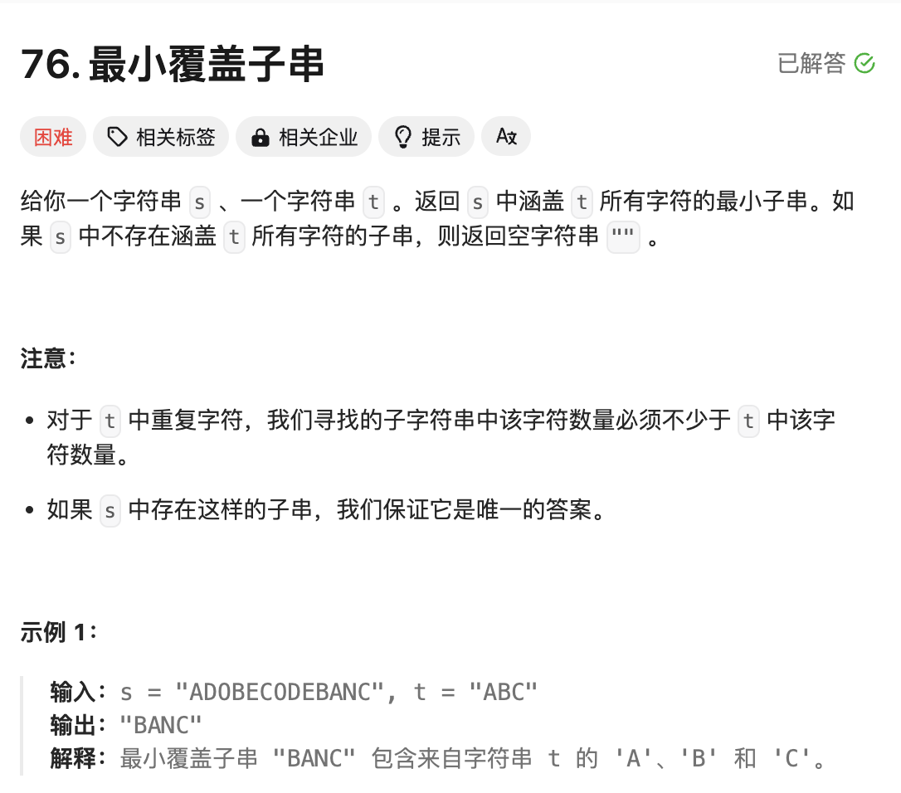
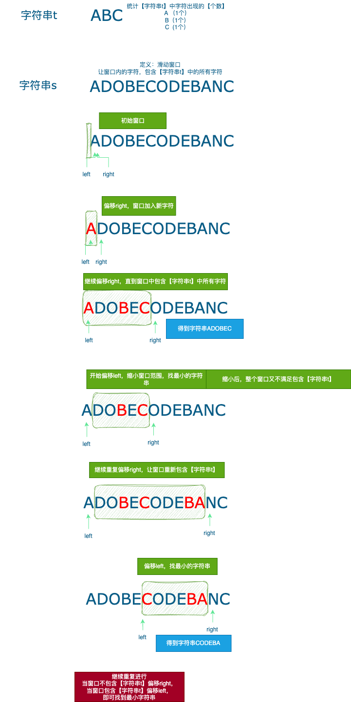

# 题目



# 思路

- 需要在`s`找到一个子串，涵盖`t`中所有字符；（注意是涵盖【字符】，没有要求子串必须要`t`中的字符顺序/字符数量一摸一样 ）
- 滑动窗口算法：不断移动`right`让窗口中包含的字符，能够涵盖`t`中的字符；一旦涵盖以后，还需要找到【最小】的子串，所以移动`left`可以让窗口变小，剔除部分无效字符，找到涵盖`t`的最小子串

滑动窗口套路伪代码：

```go
定义left = 0 right = 0

定义窗口变量win记保存结果

for 在right不越界的前提下 {
    将right加入到win中
    右移right++
	
    for 判断窗口win有效性 {
        将left从win中剔除
        右移left++
      }
}
```


**建议直接看代码，看不懂的再来看图**



# 完整代码

```go
func minWindow(s string, t string) string {
    
    // window 记录s中窗口内字符出现的频率
    need,window := make(map[byte]int),make(map[byte]int)
  	//need记录t中字符出现的频率
    for i := 0;i<len(t);i++ {
        need[t[i]]++ 
    }

    //vaild 表示窗口中已经完成覆盖的字符
    vaild := 0
    left,right := 0,0
  	// start和length为了截取字符串【记录用】
    start := 0
    length := math.MaxInt
    for right < len(s) {
        val := s[right] // val 将要进入窗口的字符
        right++

        // 判断该字符是否在need中出现
        if _,ok := need[val]; ok {
            window[val]++ 
            if window[val] == need[val] {//说明window中该字符的数量，达到了need中字符的数量
                vaild++ // 完成覆盖的字符
            }
        }

      for vaild == len(need) { //表示window中完成覆盖的字符 need中的字符个数一样【注意！！】这里是len(need)
            //找最小的子串
            if right - left < length { 
                start = left
                length = right-left
            }

            //val 将要从窗口删除的字符
            val := s[left]
            left++
            if _,ok := need[val];ok {
                if window[val] == need[val] { // val字符在window中的数量和need的数量相同
                    vaild-- // 一旦执行了window[val]-- 就会让vaild不再满足覆盖
                }
                window[val]-- 
            }
        }
    }
    if length == math.MaxInt {
        return ""
    }
    return string(s[start:start+length])
}
```


