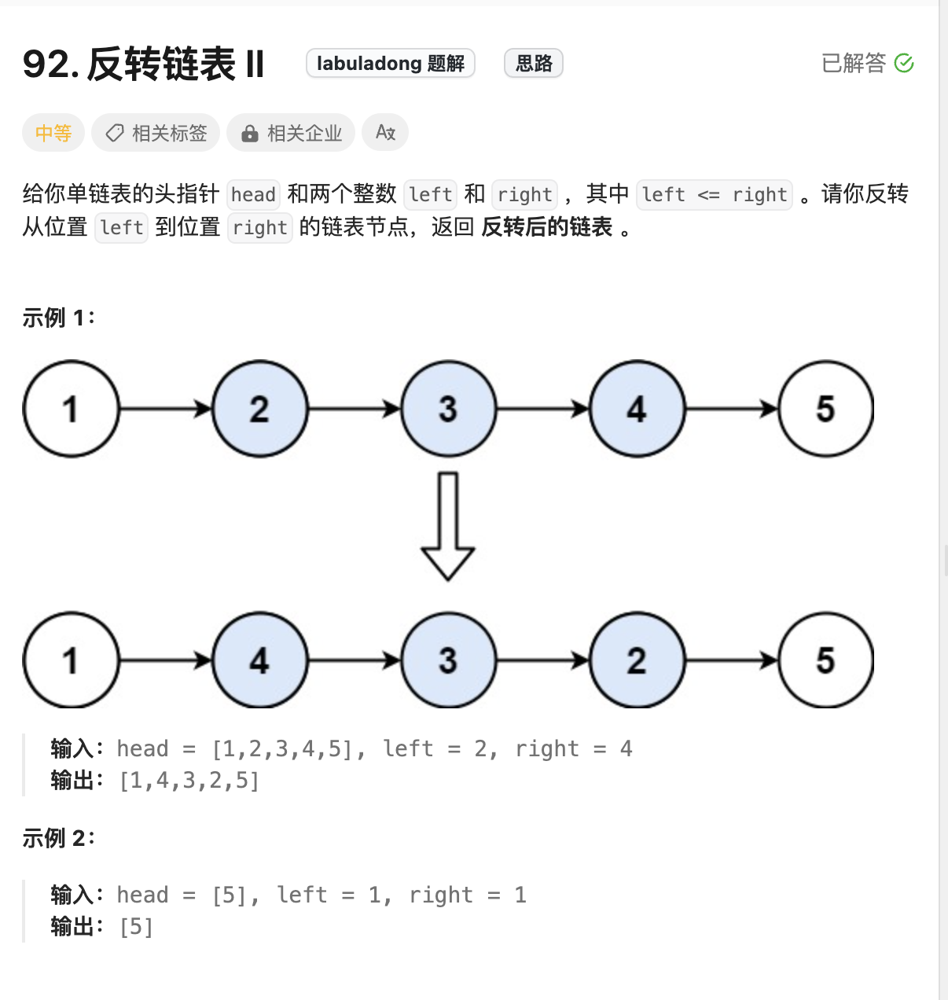
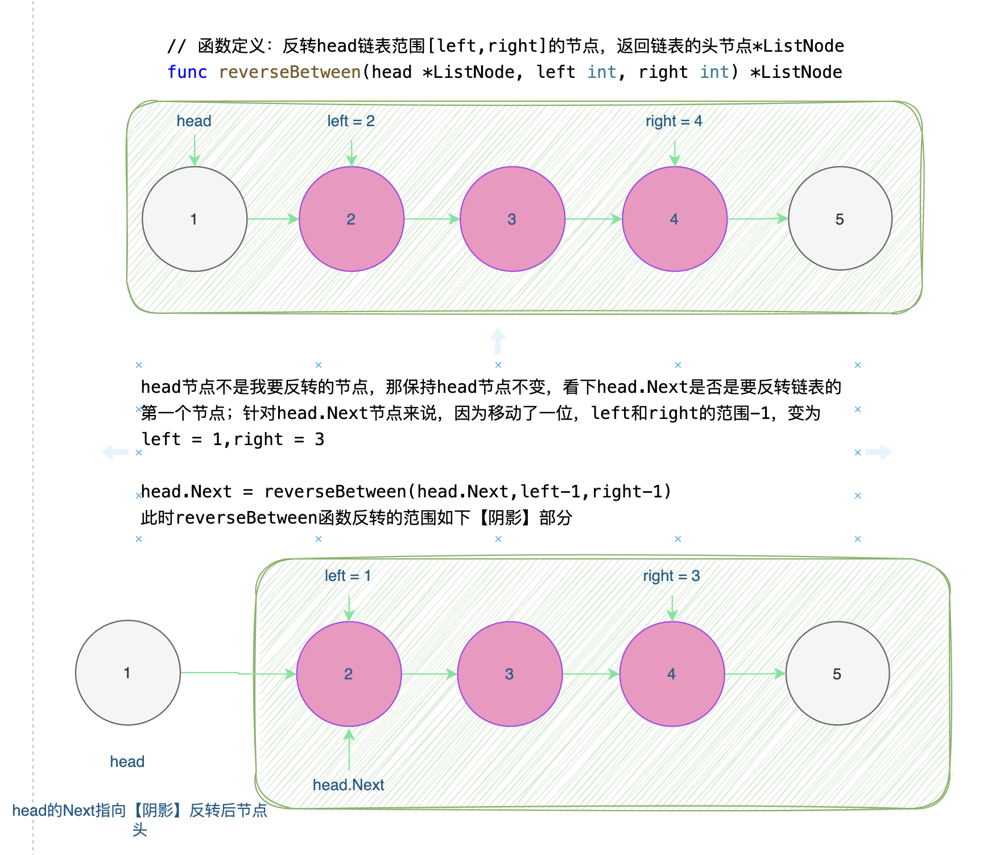
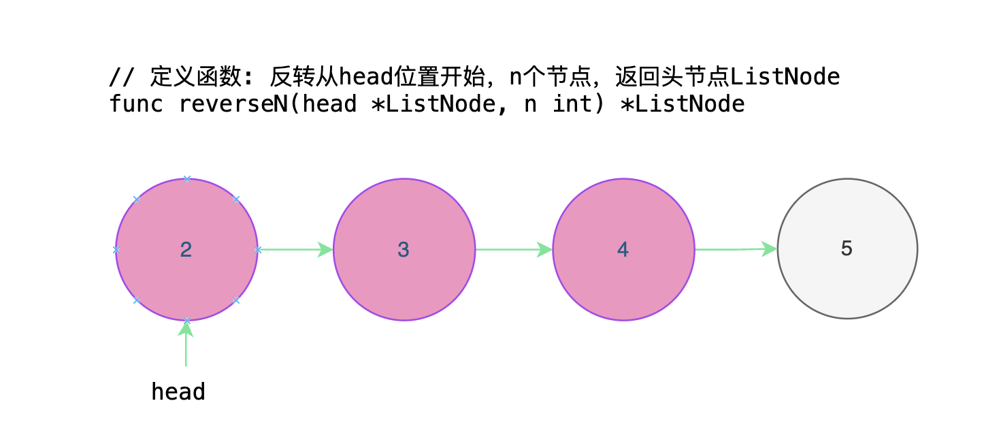
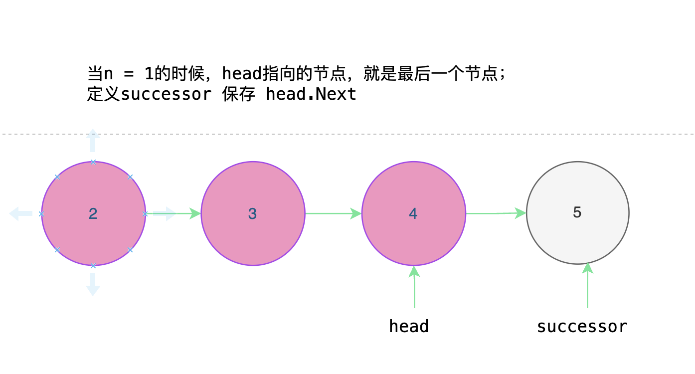
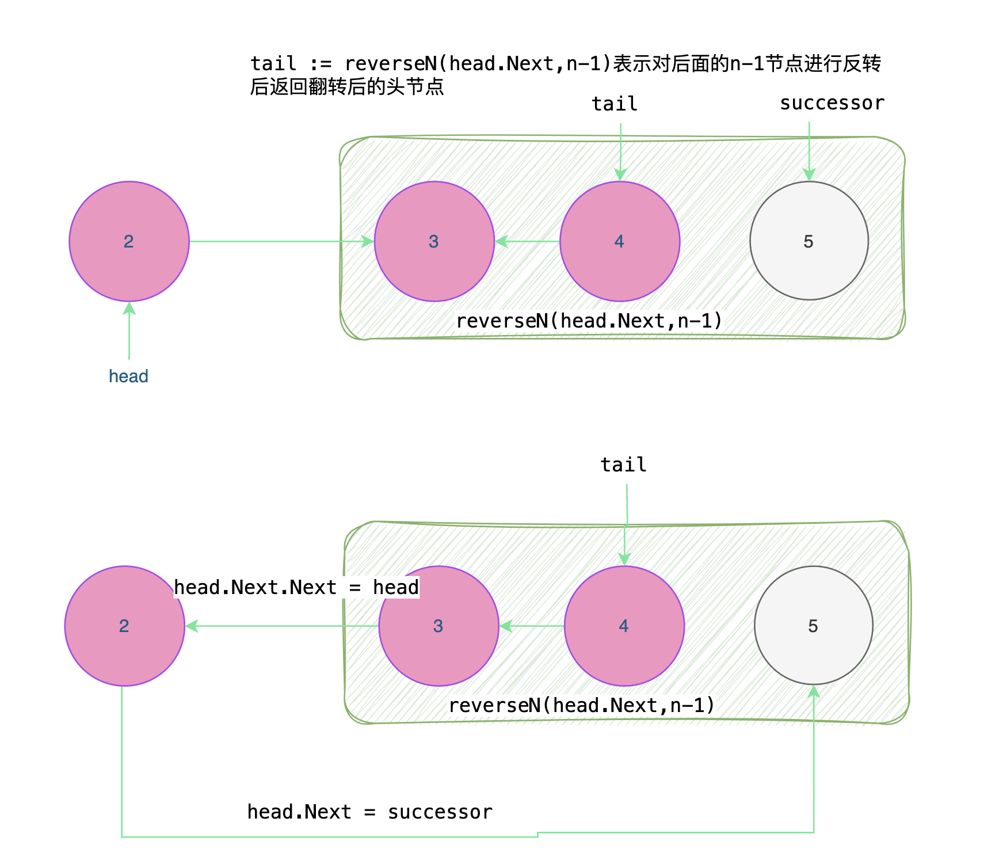

# 题目



# 解析

要求反转以head链表，指定范围的 [left,right] 的链表节点，那第一步肯定要先找到要反转链表的起始位置；



```go
 //函数定义：反转left，right之间的链表
func reverseBetween(head *ListNode, left int, right int) *ListNode {

    //说明当前节点，不需要反转。当前节点的尾部，拼接反转后链表的头部
    head.Next = reverseBetween(head.Next,left-1,right-1)
    return head
}
```

当left = 1的时候，说明找到反转链表的起始位置，开始进行反转；



```go
 //函数定义：反转left，right之间的链表
func reverseBetween(head *ListNode, left int, right int) *ListNode {

    //先找到【反转的第一个起始节点】，才开始真正的反转
    if left == 1 {
        return reverseN(head,right)
    }
   
     //说明当前节点，不需要反转。当前节点的尾部，拼接反转后链表的头部
    head.Next = reverseBetween(head.Next,left-1,right-1)
    return head
}
```




注意理解这里n的含义：表示从head开始的n个节点。当n=1的时候，表示从head开始的1个节点，head指向的就是第一个节点；

```go
var successor *ListNode = nil
// 从head开始，反转n个节点，返回链表的头节点
func reverseN(head *ListNode,  n int) *ListNode {
    if n == 1 {
        //说明当前节点就是第一个要反转的节点，记录下后缀节点指针
        successor = head.Next
        //并返回当前节点
        return head
    }

    // 将head后面的n-1个节点看成一个整体，进行反转返回头节点
    last := reverseN(head.Next,n-1)
   
    //以下图为例，这里head指向2，head.Next指向3，那head.Next.Next就是指向4，现在将head.Next.Next改成指向2；相当于实现了链表节点指向的反转
    head.Next.Next = head 
    // 此时的head.Next还是指向3的位置，所以需要将head.Next修改为指向successor
    head.Next = successor

    return last
}
```




successor的作用：原本5号节点是由4号节点指向的，调用`reverseN`反转以后，4号指向了3号节点，5号节点需要保留下来，作为整个`func reverseN(head *ListNode,  n int) *ListNode`链表反转后的后缀节点。

# 代码

```go

 //反转left，right之间的链表
func reverseBetween(head *ListNode, left int, right int) *ListNode {

    //先找到【反转的第一个起始节点】，才开始真正的反转
    if left == 1 {
        return reverseN(head,right)
    }
    //说明当前节点，不需要反转。当前节点的尾部，拼接反转后链表的头部
    head.Next = reverseBetween(head.Next,left-1,right-1)
    return head
}

var successor *ListNode = nil
// 从head开始，反转n个节点，返回链表的头节点
func reverseN(head *ListNode,  n int) *ListNode {
    if n == 1 {
        //说明当前head是链表的第一个节点
        successor = head.Next
        return head
    }

		 // 将head后面的n-1个节点看成一个整体，进行反转返回头节点
    last := reverseN(head.Next,n-1)
    
  	// 然后将head 和 已经反转后的n-1个节点链表进行整合
    head.Next.Next = head 
    head.Next = successor

    return last
}
```

# 总结

代码理解的关键在于递归函数定义的明确，将函数定义带入到调用位置，千万不要将思维不断的递归进去。比如`reverseN(head.Next,n-1)`就是对 n-1个节点进行整体反转，具体递归进去如何，我不管，我就知道这个函数可以反转后面的n-1个节点，返回反转后的链表的头节点。